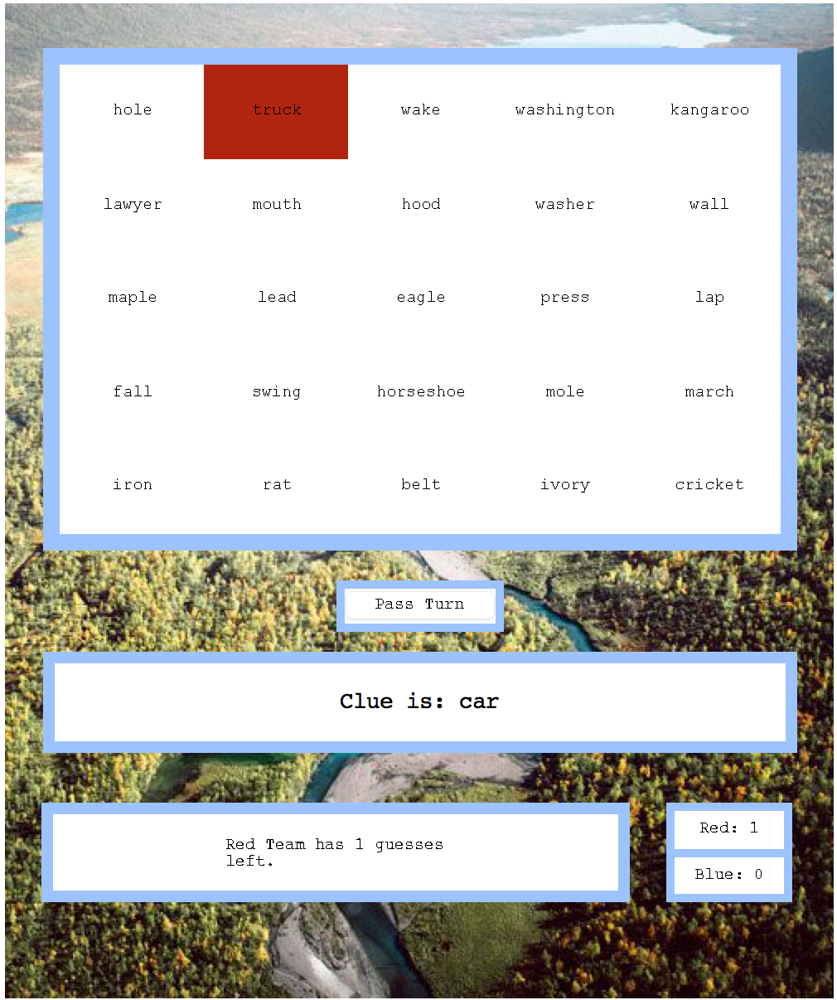

# AI-Codename-Game

## Computer Science Degree - Final Project Ariel University - Israel

### About the Game:

Codenames is a game of guessing which code names (words) in a set are related to a hint-word given by another player.
Players split into two teams: red and blue. One player of each team is selected as the team's spymaster; the others are field operatives. Twenty-five code name cards, each bearing a word, are laid out in a 5×5 rectangular grid, in random order. A number of these words represent red agents, a number represent blue agents, one represents an assassin, and the others represent innocent bystanders. The teams' spymasters are given a randomly-dealt map card showing a 5×5 grid of 25 squares of various colors, each corresponding to one of the code name cards on the table. Teams take turns. On each turn, the appropriate spymaster gives a verbal hint about the words on the respective cards. Each hint may only consist of one single word and a number that tells the field operatives how many words in the grid are related to the word of the clue. The spymaster gives a hint that is related to as many of the words on his/her own agents' cards as possible, but not to any others – lest they accidentally lead their team to choose a card representing an innocent bystander, an opposing agent, or the assassin.
The game ends when all of one team's agents are identified (winning the game for that team), or when one team has identified the assassin (losing the game).

### About the Project:

Our project use deep learning word embedding model to predict relationships between words on the Codenames board. The bot can give hints to the 2 users playing the game by using Gensim Word2Vec Library.

The dataset is Google's DataSetGoogleNews at https://drive.google.com/file/d/0B7XkCwpI5KDYNlNUTTlSS21pQmM/edit?fbclid=IwAR2cGOoPhXxpTx0GSKLOp8xCbAVFWXcofbZ16NSeyZZ9rD0AOmFXr8M95bU. This file is 1.5 GB and contains Google's dataset of millions of sentences. 

.
